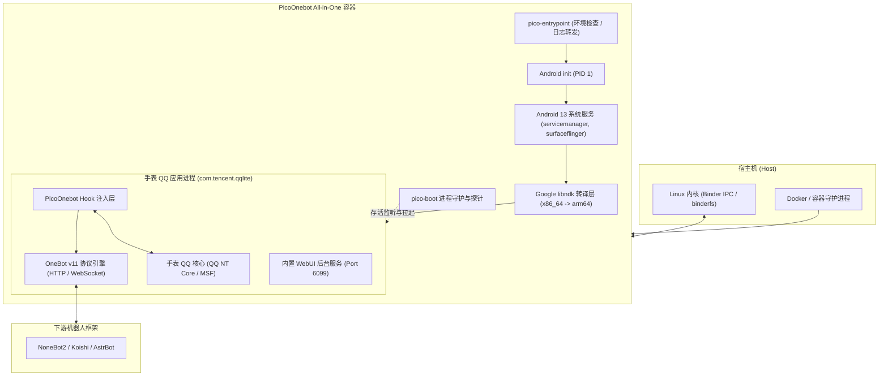

# 架构与运行原理

了解 PicoOnebot 的内部架构有助于在生产环境中更稳定地排查网络、权限及性能问题。

---

## 系统分层架构

PicoOnebot 由以下几层关键组件构成：

---

## 核心机制详解

### 1. 宿主内核 Binder 共享
与虚拟机通过 Hypervisor 模拟硬件不同，Docker 容器与宿主机**完全共享操作系统内核**。
- Android 系统底层的进程间通信（IPC）机制严重依赖内核驱动 Binder（如 `/dev/binder`、`/dev/hwbinder`、`/dev/vndbinder`）；
- Android 的核心基础服务（如 `servicemanager`、`surfaceflinger`、`system_server`）必须借助 Binder 交换数据；
- 若宿主机内核未开启 Binder 或设备节点权限配置错误，系统核心服务将无法启动，进而导致应用进程无法正常运行。

### 2. Google libndk 转译层（针对 amd64 平台）
- 官方手表 QQ 的 Native 库目前主要面向 ARM 架构（如 `armeabi-v7a`、`arm64-v8a`）；
- 在常见的 x86_64 / amd64 云服务器上，镜像集成了 Google `libndk_translation` 二进制转译技术，可在 x86_64 指令集 CPU 上透明执行 ARM 原生动态链接库，兼具高性能与高稳定性。

### 3. 应用内 Hook 与协议转换
- PicoOnebot 采用无缝打包注入机制，在手表 QQ 进程初始化阶段完成注入；
- 通过监听客户端收发包接口，将客户端内部的数据包解析转换为 OneBot v11 标准事件；
- 当下游框架调用 OneBot API（如 `send_group_msg`）时，协议引擎将结构化参数还原为应用内部调用，由官方核心组件完成最终的网络封包与发出。

### 4. 自动化守护与看护回路
- `pico-boot.sh` 作为后台独立服务由 Android init 启动；
- 脚本包含开机自启流程，自动同意首次运行弹窗协议，并以 15 秒间隔轮询应用进程状态；
- 若进程因内存回收被杀或异常崩溃，守护循环将立即将其拉起，确保机器人 7x24 小时在线。
